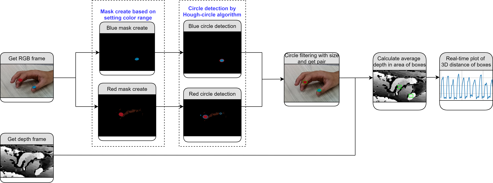
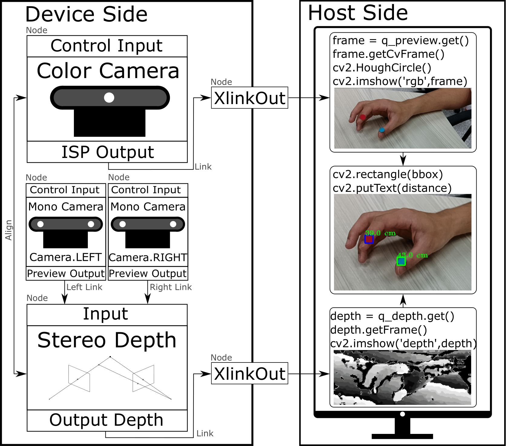

# Digitalize finger tapping movement using depth camera
This project uses the RGB frame and depth frame from the OAK-D camera to track the stickers.
Compare to 2D tracking results, including the depth information is able to prevent the error from the image plane.

## Foundation of OAK-D camera
* The OAK-D camera is a depth camera that contains an AI processor inside.
* OAK-D spec: https://store.opencv.ai/products/oak-d
* Control OAK-D camera: https://docs.luxonis.com/en/latest/

## How this project work
1. Capture the RGB frame and depth frame from the OAK-D camera.
1. Align the RGB frame and the depth frame.
1. Filter out the stickers through the HSV color mask.
1. Utilize the Hough Circles algorithm to determine the center of the stickers.
1. Get the depth information of the sticker from the depth frame which has been aligned with the RGB frame. 

<!---

-->

## Work flow of this project
* The interaction pipeline between the host side (e.g. computer) and the device side (e.g. camera): 

* The workflow after we capture the image data from the OAK-D camera:

## Conclusion
* Using the combination of the depth camera and Hough circle is highly computation efficient.
* The algorithm is nearly achieved real-time application.
* The color mask is affected by the light source and environment.
* The Hough circle is not robust enough in our case. 

## Future work
* Develop a tracking algorithm to replace the sticker and color mask, this approach isn't robust enough.
* Utilize new tracking algorithm on OAK-D's AI processor, achieve real edge computation.
* Investigate the triangulation algorithm using stereo cameras from the OAK-D, maybe that is better than using the depth map.

## Reference
* [Hough circle in OpenCV](https://docs.opencv.org/3.4/d4/d70/tutorial_hough_circle.html)
* This project is a side project from [Nordlinglab workshop 2021 OnCVnAI Hackathon](https://bitbucket.org/nordlinglab/nordlinglab-oncvnai_hackathon/src/master/)
